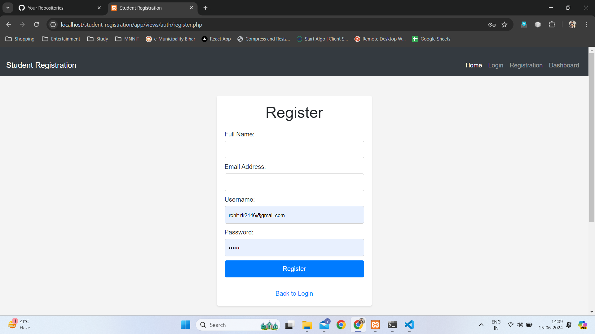

# Student Registration System

This is a simple web-based student registration system implemented in PHP. It allows students to register, login, and access a dashboard.

## Features
- Registration: Students can register with their full name, email, username, and password.
- Login: Registered students can login with their username and password.
- Forgot Password: Users can request a password reset link via email.
- Dashboard: Authenticated users can access a dashboard after login.

## Installation
1. Clone the repository: `git clone https://github.com/your-username/student-registration.git`
2. Configure the database: Edit the `config/database.php` file with your database credentials.
3. Import the database: Use the `database.sql` file to create the necessary tables.
4. Start the web server: Use a local server like XAMPP or WAMP to run the project.

## Usage
- Access the project in your web browser: `http://localhost/student-registration/public`

## In this structure

app/: Contains the main application code.
controllers/: Contains the controller classes responsible for handling requests and responses.
models/: Contains the model classes responsible for interacting with the database.
views/: Contains the view files responsible for rendering HTML output.
config/: Contains configuration files, such as database configuration.
public/: Contains publicly accessible files (CSS, JS, etc.) and the entry point (index.php) for the application.
.gitignore: Contains files and directories to be ignored by version control.
README.md: Contains project documentation and setup instructions.

## Notes
- Make sure to update the database credentials in the `config/database.php` file.
- The project uses plain PHP for simplicity. Consider using a framework for more complex projects.

## License
This project is licensed under the MIT License - see the LICENSE file for details.

## Screenshots

 

 

